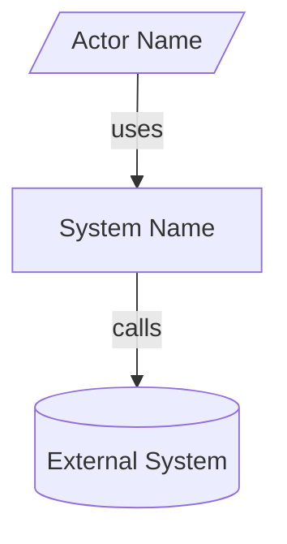
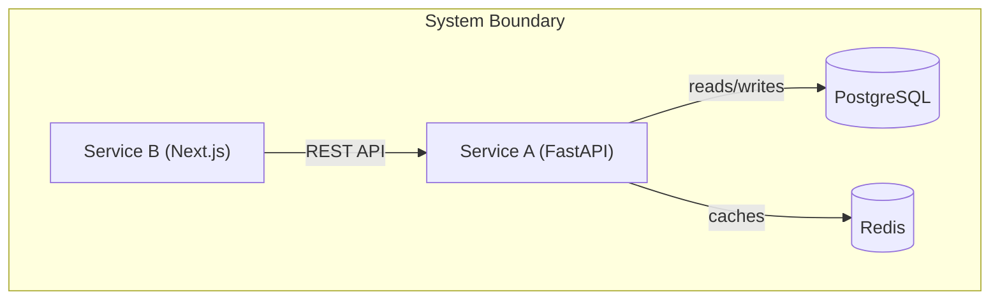
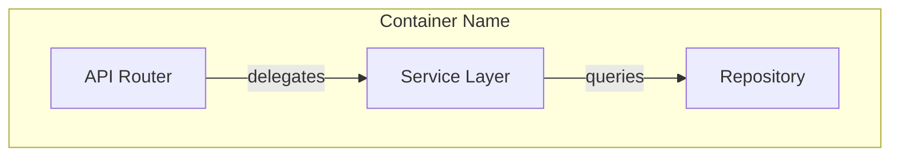
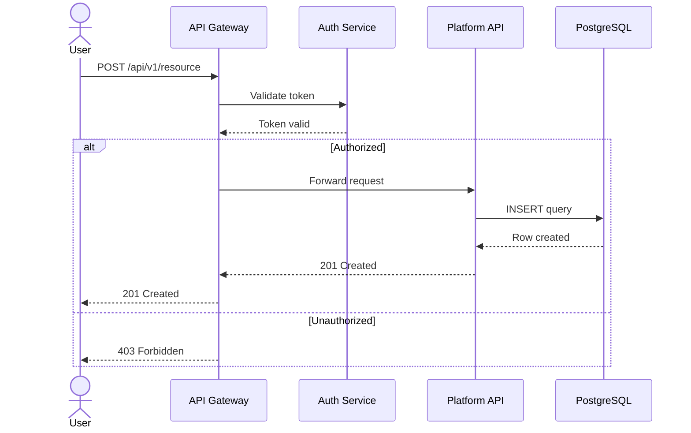
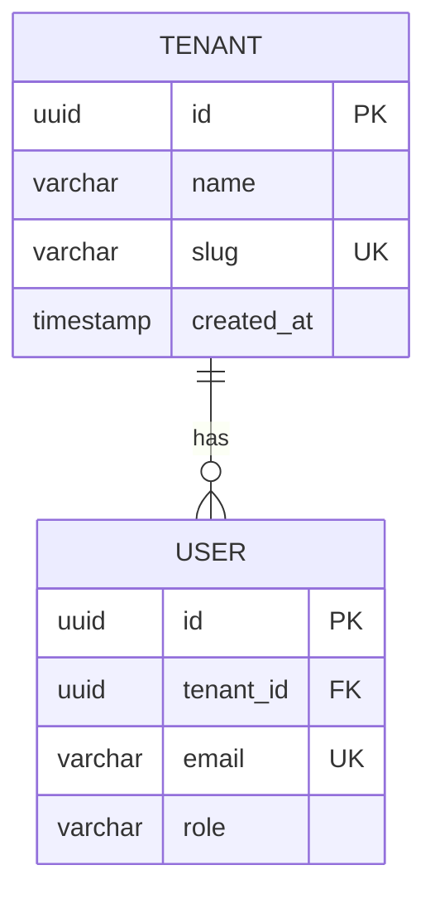
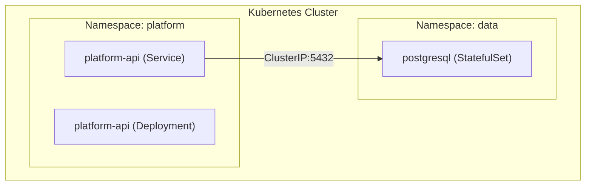
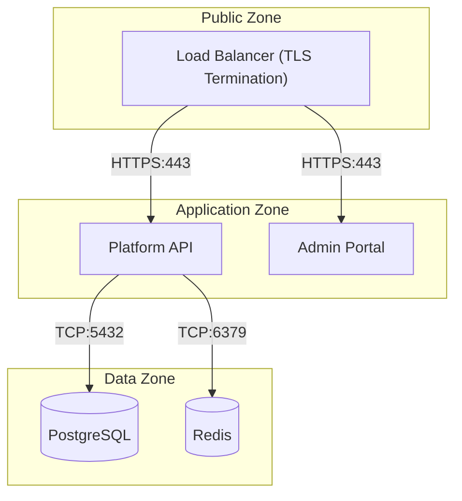

# Mermaid Diagram Standards

Standards for all Mermaid diagrams produced by the shard-architecture workflow.

## Universal Rules

1. **Descriptive node IDs** — use `platformApi`, `adminPortal`, `postgresDb` — never single letters like `A`, `B`, `C`
2. **Relationship labels on all edges** — every `-->` must have a label: `-->|"REST API call"|`
3. **Subgraphs for logical grouping** — group related components: `subgraph "Data Tier"`
4. **Title comment** above every diagram: `%% Container Diagram — Platform API and its dependencies`
5. **Syntactically valid** — must parse without error in Mermaid Live Editor
6. **No HTML tags** — never use ` `, ` `, or any HTML tags in node labels. Use `\n` inside double-quoted labels for line breaks if needed, or use a dash/parentheses separator (e.g. `"Service A (FastAPI)"`)
7. **Width constraint** — prefer `graph TD`/`TB` (top-down) over `graph LR` to keep diagrams narrow and readable in VS Code's markdown preview. Limit to **max 5 nodes per row**. If a diagram has more than 5 parallel nodes, split into multiple rows using subgraph nesting or intermediate edges

## Diagram Types and Syntax

### C4 Context Diagram (graph TD)

### C4 Container Diagram (graph TD)

### C4 Component Diagram (graph TD)

### Sequence Diagram

### Entity-Relationship Diagram

### Infrastructure Topology (graph TD)

### Network Topology (graph TD)

## Validation Checklist

For every diagram in every output document:

- [ ] Has `%%` title comment on line above
- [ ] All node IDs are descriptive (no single letters)
- [ ] All edges have labels
- [ ] Related nodes grouped in subgraphs
- [ ] Valid Mermaid syntax (parseable)
- [ ] Matches the described architecture (not generic)
